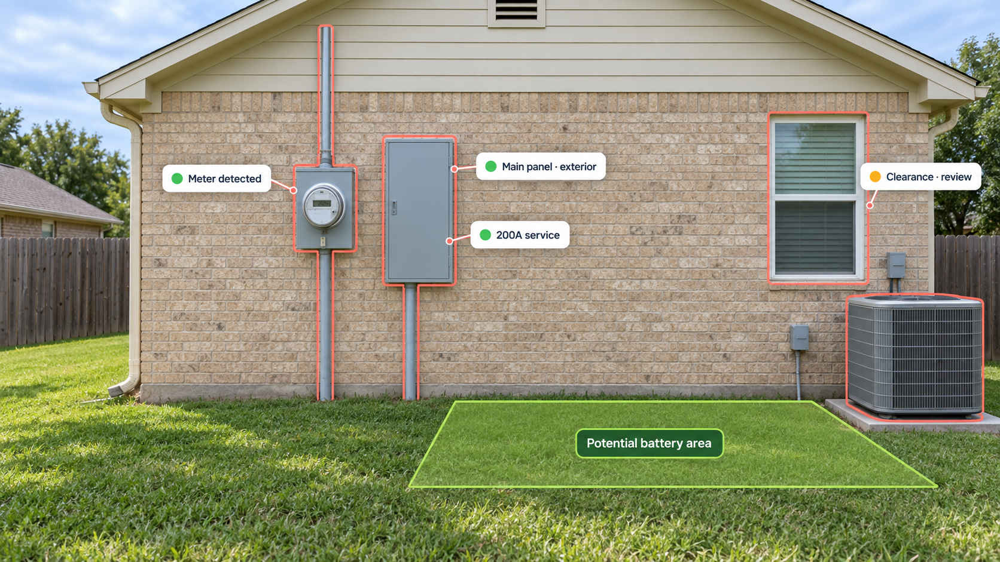
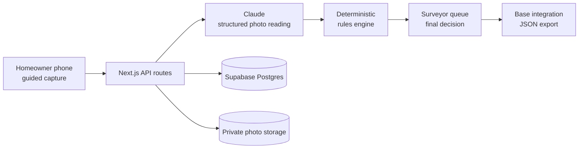

# site-check

**AI-assisted home battery site qualification that catches unusable photos before they become multi-day delays.**

Built for the Base Power Hackathon, site-check guides homeowners through a mobile photo survey, checks every image while they are still on site, and gives surveyors a structured preliminary assessment. AI reads the photos; deterministic rules make the preliminary decision; a human reviewer makes the final call.

[Try the live demo](https://sitecheck-sigma.vercel.app) · [Open the surveyor queue](https://sitecheck-sigma.vercel.app/review) · [Detailed technical documentation](./sitecheck/README.md)

## The problem

Home battery qualification starts with photos of the meter, breaker panel, and surrounding walls. Those photos often arrive dark, blurry, too close, or missing the view a surveyor needs. The homeowner has already left the meter by the time the issue is found, so one bad image can add days of back-and-forth.

## The solution

site-check moves the first quality check to the moment of capture:

1. A customer receives a unique `/capture/{homeId}` link.
2. The mobile flow shows exactly what to photograph with step-specific camera guides.
3. Claude converts each image into a validated, 27-field structured reading.
4. Bad or incomplete shots get one plain-language retake instruction immediately.
5. A whole-site pass checks coverage and can request up to two missing views.
6. A fixed rules engine returns `PASS`, `FAIL`, or `REVIEW` with a provisional 0–2 battery count.
7. A surveyor reviews the evidence, records the final decision, and exports the result.



## Why it is trustworthy

site-check deliberately separates perception from policy:

- **AI reads:** Claude identifies equipment, labels, damage, obstructions, and whether the requested view is usable.
- **Rules decide:** TypeScript rules apply Base Power's published eligibility requirements to the structured reading.
- **Humans approve:** Uncertainty, low confidence, missing views, and repairable issues route to the surveyor queue. Homeowners never see an automated approval.

If an AI call fails, site-check retries it up to three times. A photo that still cannot be checked is saved for review instead of blocking the homeowner or silently producing a decision.

## Features

- Mobile-first guided capture with live camera outlines and photo-library fallback
- Immediate checks for the wrong subject, poor framing, missing ground, closed panels, and unreadable labels
- Conditional capture plans for separate, combined, outdoor, and indoor electrical setups
- Multi-photo whole-site coverage check with targeted follow-up requests
- Deterministic eligibility and battery-count rules with human-readable reason codes
- Surveyor queue, detailed case review, recheck controls, decision audit log, and JSON export
- Private Supabase Storage with short-lived signed URLs
- Resilient AI calls with timeout, backoff, failure simulation, and graceful review fallback
- Google Maps address suggestions and property-location capture when a Maps key is configured

## Architecture



| Layer                | Technology                                                    |
| -------------------- | ------------------------------------------------------------- |
| Product app          | Next.js 16, React 19, TypeScript, Tailwind CSS 4              |
| Image analysis       | Anthropic SDK with structured JSON output and Zod validation  |
| Data and photos      | Supabase Postgres and private Storage                         |
| Address and map flow | Google Maps JavaScript, Places, and Geocoding APIs (optional) |
| Testing              | Vitest                                                        |
| Hosting              | Vercel                                                        |

## Repository layout

```text
.
├── app/                 # Polished product/operations prototype
├── public/              # Shared presentation and README assets
├── sitecheck/           # Working end-to-end submission
│   ├── src/app/         # Customer, reviewer, and API routes
│   ├── src/lib/         # AI, planning, rules, retry, and data logic
│   ├── src/components/  # Capture and shared UI components
│   └── supabase/        # Schema and migrations
└── README.md
```

The root app is the polished product vision and customer deck. The deployable, data-backed hackathon implementation lives in `sitecheck/`.

## Run locally

### Prerequisites

- Node.js 20 or newer
- An Anthropic API key
- A Supabase project
- Optional: a Google Maps browser key

### Setup

```bash
git clone https://github.com/dennycrafter/site-check.git
cd site-check/sitecheck
npm install
cp .env.example .env.local
```

On Windows PowerShell, use `Copy-Item .env.example .env.local` for the last command.

Create the database and private photo bucket by running [`sitecheck/supabase/schema.sql`](./sitecheck/supabase/schema.sql) in the Supabase SQL Editor. Then configure `.env.local`:

```dotenv
ANTHROPIC_API_KEY=sk-ant-your-key-here
SUPABASE_URL=https://your-project-ref.supabase.co
SUPABASE_SECRET_KEY=sb_secret_your-key-here
ANALYSIS_MODEL=claude-sonnet-5
SIMULATE_AI_FAILURE_RATE=0
NEXT_PUBLIC_GOOGLE_MAPS_API_KEY=
```

Start the app:

```bash
npm run dev
```

Open [http://localhost:3000](http://localhost:3000). Phone camera capture requires HTTPS; use the deployed app on a phone or select an image from the photo library during local development.

### Useful commands

```bash
npm run dev       # local development
npm run build     # production build
npm run lint      # lint the app
npm test          # rules, decisions, planning, images, and review helpers
```

After setup, [`/api/health`](https://sitecheck-sigma.vercel.app/api/health) reports connectivity to Anthropic, Postgres, and Storage.

## Integration API

site-check is designed to sit inside an existing customer signup flow:

- `POST /api/homes` creates a home and returns its capture link.
- `POST /api/homes/{id}/submit` completes the homeowner flow and calculates the preliminary result.
- `GET /api/homes/{id}/export` returns customer context, site-check results, decision reasons, and final photos grouped by slot with 24-hour signed URLs.
- `POST /api/homes/{id}/decision` records the surveyor's final decision.
- `POST /api/homes/{id}/recheck` safely reruns automated checks.

Request and response details, the full rules table, retake behavior, and export slots are documented in [`sitecheck/README.md`](./sitecheck/README.md).

## Privacy, safety, and provenance

- Photos are stored in a private bucket and shown through expiring signed URLs.
- API secrets stay server-side; none use the `NEXT_PUBLIC_` prefix.
- Demo photos are example images, not photos of real customer homes. No Base customer data was used.
- The model was not trained on submitted photos.
- The capture flow tells homeowners never to remove a screwed-on panel cover or touch wiring.
- Rules are based on Base Power's public [electrical requirements](https://help.basepowercompany.com/en/articles/10280705) and [site requirements](https://help.basepowercompany.com/en/articles/10280641).

## Current limitations

- Clearances are judged visually; the prototype does not measure physical distance.
- The surveyor pages do not yet require authentication.
- Faded equipment labels can be misread, so low-confidence findings route to `REVIEW`.
- The whole-site check can request at most two additional photos.
- A typical image check takes roughly 10–20 seconds at the configured medium reasoning effort.

## Hackathon scope

The end-to-end prototype includes customer link creation, guided capture, resilient image analysis, fixed-rule qualification, a human review workflow, audit history, and export. Next steps are calibrated distance estimation, A/C nameplate checks, suggested battery placement overlays, reviewer-feedback learning, and production authentication.

---

Built to turn photo collection from a handoff problem into a real-time qualification workflow.
