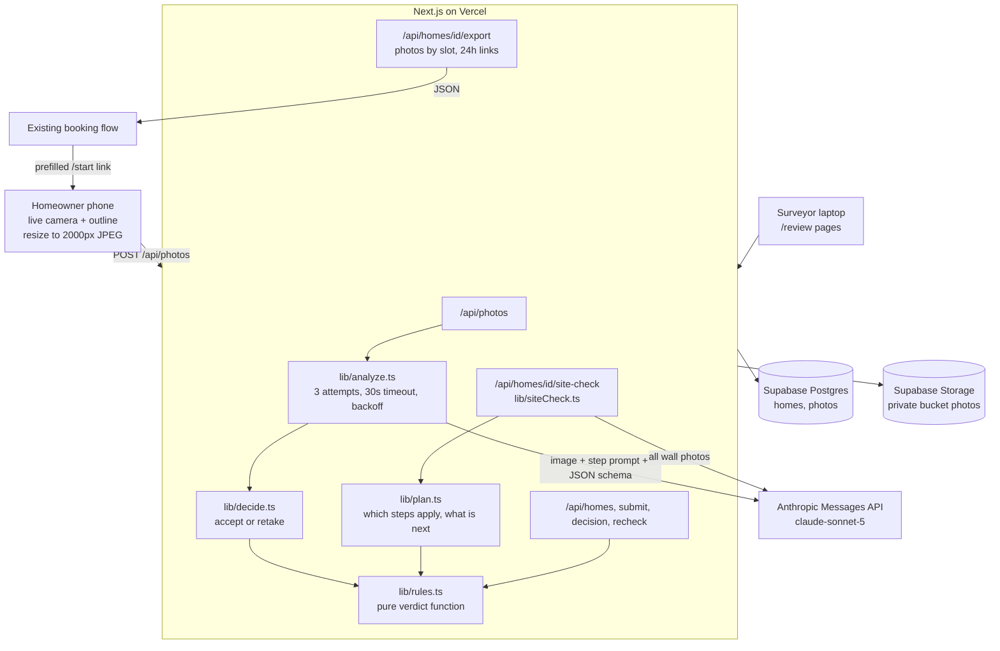

# SiteCheck

Home batteries are installed next to the electric meter, so before an install a review team looks at photos of the meter, the breaker box and the walls around them to decide if the home qualifies and for how many batteries. Homeowners often send photos that cannot be used (too dark, too close, door closed, clutter in the way), and every retake request costs days. SiteCheck fixes this at the source. The homeowner arrives from a link that already knows who they are, and the app walks them around the meter shot by shot with an outline on the live camera. A bad photo is rejected on the spot with one plain instruction. When the regular shots are done, a whole-site check makes sure the photos cover everything and asks for up to 2 more if they do not. The review team gets a labelled photo set, the AI's reading of each photo and a preliminary check from fixed rules. The AI only reads photos, fixed rules produce the preliminary check, and the final decision stays with the review team.

## Live demo

https://sitecheck-sigma.vercel.app

- Homeowner flow: https://sitecheck-sigma.vercel.app/start (open on a phone for the live camera)
- Surveyor queue: https://sitecheck-sigma.vercel.app/review
- Health check: https://sitecheck-sigma.vercel.app/api/health

## Quick start

You need Node.js LTS (version 20 or newer).

```bash
git clone https://github.com/dennycrafter/base-home-check.git
cd base-home-check/sitecheck
npm install
cp .env.example .env.local   # on Windows: copy .env.example .env.local
```

1. Fill in `.env.local` (see the table under "Reproduce the demo").
2. In the Supabase dashboard, open SQL Editor, New query, paste the contents of `supabase/schema.sql`, and click Run.
3. Start the app:

```bash
npm run dev
```

4. Open `http://localhost:3000`.

Note: phone cameras only work over HTTPS, so test on phones using the deployed URL. On a laptop, `localhost` works, and every step also has "Upload a photo instead".

## Tech stack

- Next.js (App Router, TypeScript, Tailwind CSS) for all pages and API routes
- `@anthropic-ai/sdk` calling `claude-sonnet-5` with structured JSON output (server only)
- `@supabase/supabase-js` with the secret key for Postgres and private Storage (server only)
- `zod` to validate request bodies and the AI's JSON
- `qrcode` for the landing page QR code
- `vitest` for rules engine unit tests
- Vercel Hobby for hosting and HTTPS

## Architecture



- The AI only reads. Every photo is turned into the same fixed JSON schema (27 required fields, no free-form verdicts), validated with zod after lowercasing enum values.
- A photo that the AI can read but that does not show enough to decide is sent back with a specific instruction (see "Retake triggers" below).
- After the regular steps, one whole-site check (`src/lib/siteCheck.ts`, `POST /api/homes/{id}/site-check`) looks at all the wall photos together. If a view is missing it adds up to 2 "One more photo" steps with its own instruction. If it cannot run, the homeowner still finishes and the review team sees REVIEW.
- A pure rules engine (`src/lib/rules.ts`) turns those readings into PASS, FAIL or REVIEW plus a battery count of 0, 1 or 2, with a reason for every decision.
- Anything uncertain goes to a human: low confidence turns a FAIL into REVIEW, and missing, unclear or unchecked photos add REVIEW reasons.
- Each AI call gets up to 3 attempts with a 30 second timeout and 1 s / 3 s backoff. If all fail, the photo is saved as `check_failed`, the homeowner keeps going, and the surveyor sees REVIEW.
- Surveyors can re-run every check for a home in parallel (4 at a time); one failed step never blocks the rest.
- Homeowners never see the preliminary check. Photos stay in a private bucket and are shown on the review pages through 1-hour signed URLs.
- AI calls run at medium effort. Lower effort was faster but missed details like the ground below the meter.

## How it plugs into an existing flow

SiteCheck does not own the customer. It starts from a link sent by the system that already knows the customer, and it hands the finished photo set back.

1. **Start from a prefilled link.** Send the customer to:

   ```
   /start?name=Jane%20Doe&email=jane@example.com&austin=yes&solar=no&ref=ORDER-123
   ```

   - With `name`, a valid `email`, `austin` and `solar` all present, the customer goes straight to the camera. No form.
   - With only some of them, the customer sees a short "Check your details" form with those fields filled in.
   - With none, the customer sees the address form.
   - `ref` is stored as the external order reference and shown on the review pages. An optional `address` parameter is also accepted.
   - The QR code on the landing page opens a demo customer link, so you can try the no-form path on a phone.

   A system can also create the home directly with `POST /api/homes` (`customerName`, `customerEmail`, `inAustin`, `hasSolar`, `externalRef`, optional `address`) and send the customer to `/capture/{id}`.

2. **Pull the result.** `GET /api/homes/{id}/export` returns JSON with the external reference, customer details, answers, the whole-site check result, the preliminary check with its reasons, and every final photo grouped by slot name. Each photo has a signed link valid for 24 hours plus the AI's reading. The review page has an "Export for Base (JSON)" button that opens the same data.

| Step | Export slot |
|---|---|
| Meter and wall | `electric_meter_surroundings` |
| Meter close-up | `electric_meter_close_up` |
| Left of the meter | `electric_meter_left` |
| Right of the meter | `electric_meter_right` |
| Around the corner | `electric_meter_around_corner` |
| Behind the fence (only if a fence is seen) | `electric_meter_behind_fence` |
| Breaker box and surroundings (skipped for combo meter and main units) | `main_breaker_box_wall` |
| Breaker box open (skipped for combo meter and main units) | `main_breaker_box_open` |
| Main switch | `main_disconnect_switch_photo` |
| One more photo (from the whole-site check) | `electric_meter_additional` |

## How the rules work

Rules are derived from Base Power's public help center: [article 10280705](https://help.basepowercompany.com/en/articles/10280705) and [article 10280641](https://help.basepowercompany.com/en/articles/10280641).

| Code | Outcome | When |
|---|---|---|
| `STEP_MISSING` | REVIEW | A required photo is missing |
| `STEP_UNCLEAR` | REVIEW | A photo flagged for a retake was kept, after 3 tries or by the homeowner |
| `CHECK_FAILED` | REVIEW | The automatic check was unavailable for a photo |
| `AMP_UNREADABLE` | REVIEW | Main breaker amp rating not legible |
| `SITE_CHECK_FAILED` | REVIEW | The whole-site check could not run |
| `AMP_TOO_LOW` | FAIL | Below 150A in Austin, below 100A elsewhere |
| `AMP_LOCATION_UNKNOWN` | REVIEW | 100-149A and it is not yet known if the home is in Austin |
| `SOLAR_UNKNOWN` | REVIEW | 150-199A and it is not yet known if the home has solar (the count depends on it) |
| `AMP_ABOVE_200` | REVIEW | Above the published 100-200A range |
| `AMP_OK` | PASS | Without solar, 150A or more supports 2 batteries. With solar, 200A supports 2. Otherwise 1 |
| `SOLAR_LIMITS_TO_ONE` | PASS | Home has solar and is below 200A, so 1 battery |
| `SETUP_UNCLEAR` | REVIEW | Could not tell the meter and breaker box setup |
| `PANEL_IN_LIVING_SPACE` | FAIL | Breaker box is in a closet or elsewhere inside the living space (outdoors and garage are fine) |
| `PANEL_NOT_SAME_WALL` | REVIEW | Homeowner says the indoor breaker box is not behind the meter wall |
| `PANEL_WALL_UNSURE` | REVIEW | Homeowner not sure where the indoor breaker box is |
| `MULTIPLE_METERS` | REVIEW | More than one electric meter visible |
| `MULTIPLE_PANELS` | REVIEW | More than one breaker box visible |
| `DAMAGE` | REVIEW | Physical damage (broken, loose, exposed wires, burn marks) on meter, breaker box or main switch. Rust alone does not count |
| `PANEL_RECALLED_BRAND` | REVIEW | Open breaker box is Federal Pacific, Zinsco, Challenger or Sylvania |
| `PANEL_BRAND_CHECK` | REVIEW | Open breaker box is Westinghouse |
| `PANEL_BRAND_UNREADABLE` | REVIEW | Breaker box brand or label could not be read |
| `HEAVY_RUST` | REVIEW | Heavy rust on the breaker box or main switch |
| `OBSTACLE_NEAR_METER` | REVIEW | Gas meter, window or A/C unit near the meter |
| `NO_SPACE` | FAIL | No clear ground space in any photo |
| `SPACE_UNCLEAR` | REVIEW | Ground space could not be judged |
| `SPACE_OK` | PASS | Space fits 1 or 2 batteries |
| `CAPPED_BY_SPACE` | PASS | Panel supports 2 batteries but space fits 1 |

Photos from the whole-site check's extra steps count toward the space rules.

Whether the home is in Austin and whether it has solar come from the prefilled link or the details form (see "How it plugs into an existing flow"). Until they are known, any rule that depends on them goes to REVIEW instead of guessing.

Any FAIL makes the preliminary check FAIL with 0 batteries. Otherwise any REVIEW makes it REVIEW with a provisional count. Otherwise PASS with the smaller of the panel and space limits. Any FAIL that comes from a photo read with confidence below 80 is downgraded to REVIEW. Problems that can be repaired before install (damage, heavy rust, a recalled breaker box brand) are REVIEW with a "Needs repair before install" message, so FAIL is kept for things that are hard to change. The final decision stays with the review team.

### Retake triggers

Before a photo is accepted, it must show enough to decide. If the AI did not give its own retake instruction, these checks send the photo back:

| Step | Sent back when | Instruction |
|---|---|---|
| Meter close-up | The whole meter box is not in the frame | Step back a little so the whole meter box fits, with some wall around it. |
| Meter and wall, left, right, around the corner, behind the fence, extra photos | The ground is not visible | Tilt your phone down a little so we can see the ground by the wall. |
| Left, right, around the corner, behind the fence | Less than about 6 feet of wall and ground is shown (the wall may run out of the frame) | Step back so we can see more of the wall and the ground in front of it. |
| Breaker box and surroundings | The room or wall around the box is not visible | Step back so we can see the room or wall around the breaker box. |

Plants, clutter, vehicles or fences in front of a wall are recorded as findings, never a reason to retake. Under every retake request the homeowner can tap "Use this photo anyway" to keep the photo and move on. It is marked "Kept for review" and adds a `STEP_UNCLEAR` REVIEW reason, the same as a photo kept after 3 tries.

## Reproduce the demo

Environment variables (server only, never prefixed with `NEXT_PUBLIC_`):

| Name | Purpose |
|---|---|
| `ANTHROPIC_API_KEY` | Anthropic API key |
| `SUPABASE_URL` | Supabase project URL |
| `SUPABASE_SECRET_KEY` | Supabase secret (or service_role) key |
| `ANALYSIS_MODEL` | `claude-sonnet-5` |
| `SIMULATE_AI_FAILURE_RATE` | `0` normally, `0.3` for the resilience demo |

To show resilience, set `SIMULATE_AI_FAILURE_RATE=0.3` (in `.env.local`, or in Vercel then redeploy) and complete a home. The server log shows one line per AI attempt, for example:

```
[analyze] home=... step=meter_closeup attempt=1 ok=false ms=0 err=Simulated AI failure
[analyze] home=... step=meter_closeup attempt=2 ok=true ms=6120 err=
```

The flow still completes; any step that fails all 3 attempts is saved as `check_failed` and shows up as REVIEW.

Check connectivity at `/api/health`, which returns `{ "anthropic": "OK", "database": "OK", "storage": "OK" }` when everything is set up.

Run the rules engine tests:

```bash
npx vitest run
```

## Data and provenance

- Rules come from Base Power's public help center and public customer-facing requirements only (links above).
- Photos used in the demo were taken by the team of their own or consenting friends' homes.
- No Base customer data was used.
- No model training. Photos are only sent to the Anthropic API for analysis.

## Known limitations

- Distances are not measured (Level 3). Clearances like "3 ft from the gas meter" are judged visually.
- "Same wall" for indoor breaker boxes relies on the homeowner's answer and single-photo judgment.
- No authentication on the surveyor page (prototype).
- The AI can misread faded labels, which is why low confidence goes to REVIEW instead of FAIL.
- The breaker box brand is read from the label only. A missing or painted-over label goes to REVIEW.
- The whole-site check judges coverage from the photos alone. It can ask for a photo that was not needed, and at most 2 extra photos are asked for.
- Each photo check takes about 10 to 20 seconds at medium effort.

## Next steps

- Level 3 distance estimates using the outline as a scale reference.
- A/C nameplate photo to flag LRA above 160 (soft start needed).
- Drawing a suggested battery spot on the photo.
- Learning from surveyor overrides.
- Send the prefilled link from the booking flow by email or text, and push the export automatically when a home is submitted instead of waiting for a pull.

## Team

To be filled in by the team before submission.
