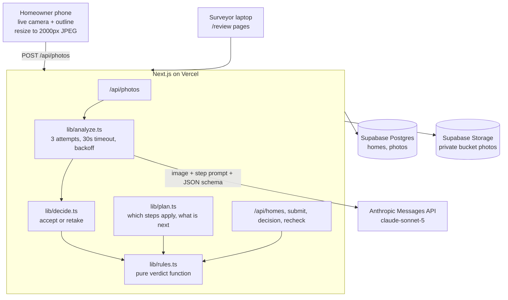

# SiteCheck

Base Power installs home batteries next to a home's electric meter. Before every install, a Base surveyor reviews photos the homeowner took of their meter, breaker box and surrounding walls to decide if the home qualifies and for how many batteries. Homeowners often send unusable photos (too dark, too close, lid closed, clutter in the way), so surveyors must ask for retakes, which costs days. SiteCheck fixes this at the source: it walks the homeowner around their meter shot by shot with an outline on the live camera (like vehicle inspection apps), rejects a bad photo instantly with a plain instruction, reads the key facts with AI, applies Base's published requirements as fixed rules, and puts a pre-filled verdict in a surveyor queue. The AI only reads photos; fixed rules decide; anything uncertain goes to a human.

## Live demo

Deployed URL: to be added after the Vercel deploy.

## Quick start

You need Node.js LTS (version 20 or newer).

```bash
git clone https://github.com/<your-account>/sitecheck.git
cd sitecheck
npm install
cp .env.example .env.local   # on Windows: copy .env.example .env.local
```

1. Fill in `.env.local` (see the table under "Reproduce the demo").
2. In the Supabase dashboard, open SQL Editor, New query, paste the contents of `supabase/schema.sql`, and click Run.
3. Start the app:

```bash
npm run dev
```

4. Open `http://localhost:3000`.

Note: phone cameras only work over HTTPS, so test on phones using the deployed URL. On a laptop, `localhost` works, and every step also has "Upload a photo instead".

## Tech stack

- Next.js (App Router, TypeScript, Tailwind CSS) for all pages and API routes
- `@anthropic-ai/sdk` calling `claude-sonnet-5` with structured JSON output (server only)
- `@supabase/supabase-js` with the secret key for Postgres and private Storage (server only)
- `zod` to validate request bodies and the AI's JSON
- `qrcode` for the landing page QR code
- `vitest` for rules engine unit tests
- Vercel Hobby for hosting and HTTPS

## Architecture



- The AI only reads. Every photo is turned into the same fixed JSON schema (19 required fields, no free-form verdicts), validated with zod after lowercasing enum values.
- A pure rules engine (`src/lib/rules.ts`) turns those readings into PASS, FAIL or REVIEW plus a battery count of 0, 1 or 2, with a reason for every decision.
- Anything uncertain goes to a human: low confidence turns a FAIL into REVIEW, and missing, unclear or unchecked photos add REVIEW reasons.
- Each AI call gets up to 3 attempts with a 30 second timeout and 1 s / 3 s backoff. If all fail, the photo is saved as `check_failed`, the homeowner keeps going, and the surveyor sees REVIEW.
- Surveyors can re-run every check for a home in parallel (4 at a time); one failed step never blocks the rest.
- Homeowners never see the verdict. Photos stay in a private bucket and are shown to surveyors through 1-hour signed URLs.

## How the rules work

Rules are derived from Base Power's public help center: [article 10280705](https://help.basepowercompany.com/en/articles/10280705) and [article 10280641](https://help.basepowercompany.com/en/articles/10280641).

| Code | Outcome | When |
|---|---|---|
| `STEP_MISSING` | REVIEW | A required photo is missing |
| `STEP_UNCLEAR` | REVIEW | Homeowner could not get a clear photo in 3 tries |
| `CHECK_FAILED` | REVIEW | The automatic check was unavailable for a photo |
| `AMP_UNREADABLE` | REVIEW | Main breaker amp rating not legible |
| `AMP_TOO_LOW` | FAIL | Below 150A in Austin, below 100A elsewhere |
| `SOLAR_NEEDS_200A` | FAIL | Home has solar and main breaker is below 200A |
| `AMP_ABOVE_200` | REVIEW | Above the published 100-200A range |
| `AMP_OK` | PASS | 200A supports 2 batteries, otherwise 1 |
| `SETUP_UNCLEAR` | REVIEW | Could not tell the meter and breaker box setup |
| `PANEL_IN_CLOSET` | FAIL | Breaker box is in a closet |
| `PANEL_NOT_SAME_WALL` | FAIL | Indoor breaker box not on the meter wall |
| `PANEL_WALL_UNSURE` | REVIEW | Homeowner not sure where the indoor breaker box is |
| `MULTIPLE_PANELS` | REVIEW | More than one breaker box visible |
| `DAMAGE` | FAIL | Visible damage on meter, breaker box or main switch |
| `OBSTACLE_NEAR_METER` | REVIEW | Gas meter, window or A/C unit near the meter |
| `NO_SPACE` | FAIL | No clear ground space in any photo |
| `SPACE_UNCLEAR` | REVIEW | Ground space could not be judged |
| `SPACE_OK` | PASS | Space fits 1 or 2 batteries |
| `CAPPED_BY_SPACE` | PASS | Panel supports 2 batteries but space fits 1 |

Any FAIL makes the verdict FAIL with 0 batteries. Otherwise any REVIEW makes it REVIEW with a provisional count. Otherwise PASS with the smaller of the panel and space limits. Any FAIL that comes from a photo read with confidence below 80 is downgraded to REVIEW.

## Reproduce the demo

Environment variables (server only, never prefixed with `NEXT_PUBLIC_`):

| Name | Purpose |
|---|---|
| `ANTHROPIC_API_KEY` | Anthropic API key |
| `SUPABASE_URL` | Supabase project URL |
| `SUPABASE_SECRET_KEY` | Supabase secret (or service_role) key |
| `ANALYSIS_MODEL` | `claude-sonnet-5` |
| `SIMULATE_AI_FAILURE_RATE` | `0` normally, `0.3` for the resilience demo |

To show resilience, set `SIMULATE_AI_FAILURE_RATE=0.3` (in `.env.local`, or in Vercel then redeploy) and complete a home. The server log shows one line per AI attempt, for example:

```
[analyze] home=... step=meter_closeup attempt=1 ok=false ms=0 err=Simulated AI failure
[analyze] home=... step=meter_closeup attempt=2 ok=true ms=6120 err=
```

The flow still completes; any step that fails all 3 attempts is saved as `check_failed` and shows up as REVIEW.

Check connectivity at `/api/health`, which returns `{ "anthropic": "OK", "database": "OK", "storage": "OK" }` when everything is set up.

Run the rules engine tests:

```bash
npx vitest run
```

## Data and provenance

- Rules are derived from Base Power's public help center (links above).
- Photos used in the demo were taken by the team of their own or consenting friends' homes.
- No Base customer data was used.
- No model training. Photos are only sent to the Anthropic API for analysis.

## Known limitations

- Distances are not measured (Level 3). Clearances like "3 ft from the gas meter" are judged visually.
- "Same wall" for indoor breaker boxes relies on the homeowner's answer and single-photo judgment.
- No authentication on the surveyor page (prototype).
- The AI can misread faded labels, which is why low confidence goes to REVIEW instead of FAIL.

## Next steps

- Level 3 distance estimates using the outline as a scale reference.
- A/C nameplate photo to flag LRA above 160 (soft start needed).
- Drawing a suggested battery spot on the photo.
- Learning from surveyor overrides.
- Integration into Base's booking flow via email link, QR code or live with a sales rep.

## Team

To be filled in by the team before submission.
